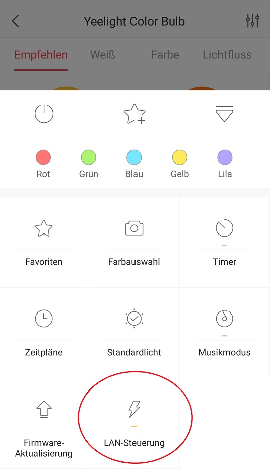

# ioBroker.yeelight-2
=================

Dieser Adapter steuert Yeelight Lampen. Statusäderungen durch die App werden direkt erkannt.
## Versionsprung
Beim wechsel von der 0.4.X zur 0.9.X oder höher müssen die objekte manuell alle gelöscht werden, damit sie neu erzeugt werden können.

## Installation

Bei vielen Lampem muss über die Yeelight app der Lan Modus aktiviert werden, bevor sie gefunden und gesteuert werden können. 

## Config
Die Leuchten können manuell hinzugefügt werden oder gesucht werden. Es kann die IP, smartname, port und der Name angepasst werden. Der Standard Port ist 55443. Wird ein Leerzeichen im Namen benutzt wird es ersetzt durch "_". 

Bitte Beachten, dass beim adapterstart alle Lampen eingeschaltet (mit Spannung versorgt sind).

### smartname
Wird ein Smartname in der Config eingegeben, wird diese Lampe automatisch zum Cloud adapter hinzugefügt und kann über alexa gesteuert werden.

### Find device
über diese Funktion können die Lampen automatisch gesucht und hinzugefügt werden. die Suche dauert ca 20 Sekunden. Die gefundenen Geräte werden anschließend in der Tabelle aufgelistet.

## Changelog
### 0.9.6 (2018-12-08)
* (MeisterTR) yeelight-wifi hinzugefügt
* (MeisterTR) Fehler behoben
* (MeisterTR) manuell hinzugefügte Lampen werden erlannt
* (MeisterTR) Error handling optimiert
* (MeisterTR) ausgeschaltete Lampen beim start werden überwacht bis sie online sind
* (MeisterTR) Fehler beim Löschen von Objekten und Smartname bug behoben
### 0.9.1 (2018-10-31)
* (MeisterTR) Offline erkennung, daten werden gepollt
### 0.9.0 (2018-08-29)
* (MeisterTR) Neu aufgebaut
### 0.4.1 (2018-08-29)
* (MeisterTR) fixed JSON error
### 0.4.0 (2018-08-29)
* (MeisterTR) fixed errors
* (MeisterTR) added scenen
### 0.3.6 (2018-07-07)
* (MeisterTR) catch spaces in config, small performance changes
### 0.3.5 (2018-06-18)
* (MeisterTR) added yeelight650, fixed some bugs, power on when ct change
### 0.2.9 (2018-06-07)
* (MeisterTR) change name for repo and npm
### 0.2.8 (2018-06-01)
* (MeisterTR) fixed bug wit port, fixed set ct by alexa
### 0.2.6 (2018-05-31)
* (MeisterTR) fixed manny bugs.
### 0.2.0 (2018-03-07)
* (MeisterTR) many changes add smartname Option, add manual devices, many fixes
* (MeisterTR) fix role for alexa
### 0.1.1 (2018-03-07)
* (MeisterTR)return to default value when turn on
* (MeisterTR)fix role for alexa
### 0.1.0 (2018-03-07)
* (MeisterTR) many changes, add hue and sat for alexa control
### 0.0.2 (2018-03-07)
* (MeisterTR) objects not overwirte after restart
### 0.0.2 (2018-03-07)
* (MeisterTR) testing added, log changed
### 0.0.1 (2018-01-29)
* (cahek2202) initinal version

base from: adb backup https://github.com/cahek2202/ioBroker.yeelight
